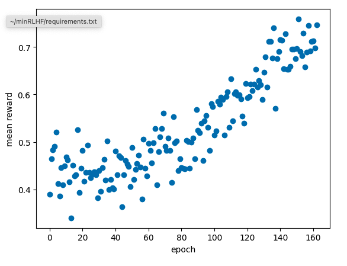

# minRLHF

A (somewhat) minimal library for finetuning language models with PPO on human feedback.   
Primarily for educational purposes but can be used to train up to 1B parameter models.  
Inspired by Andrej Karpathy's minGPT and OpenAI's spinning up.  

Clone and install locally (ie with `pip install .`) and see `examples/huggingface_example.ipynb` for how to get started.

Future work:
- Produce a JAX version of this
- Produce a demo showing how you can finetune minGPT models for dependency free RLHF.
